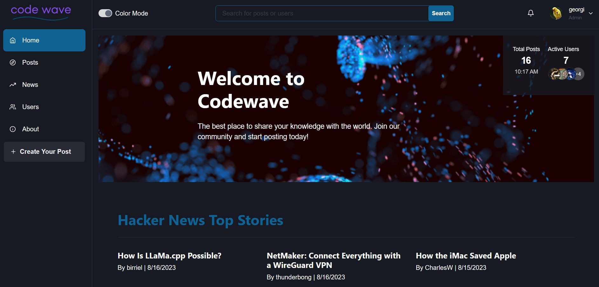
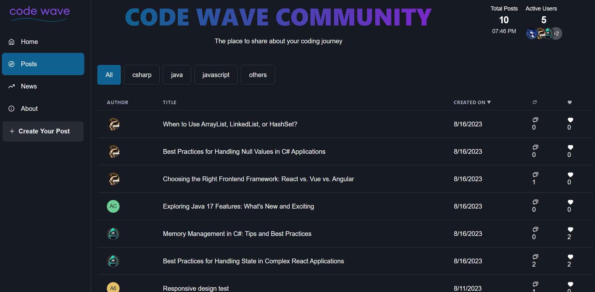
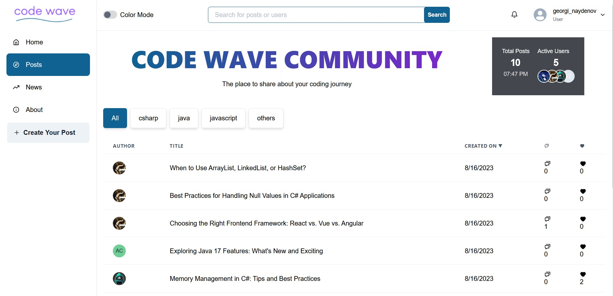
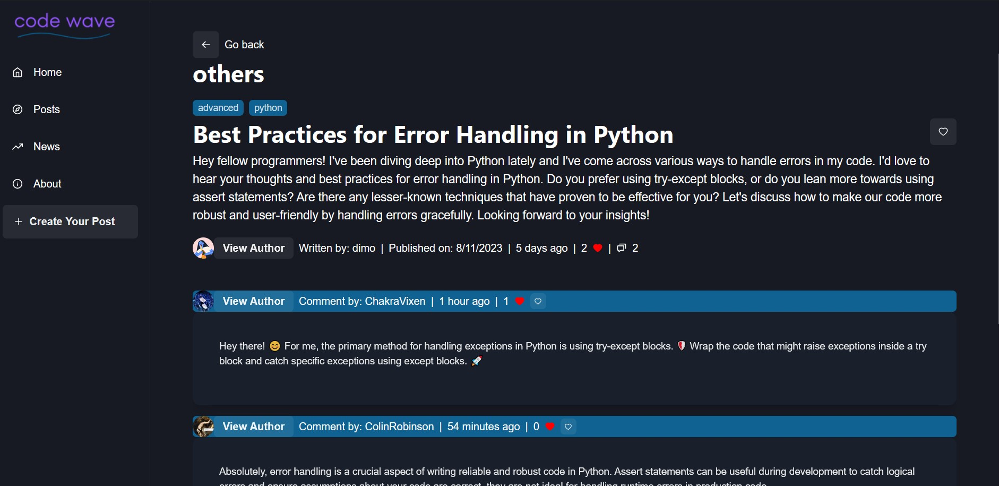
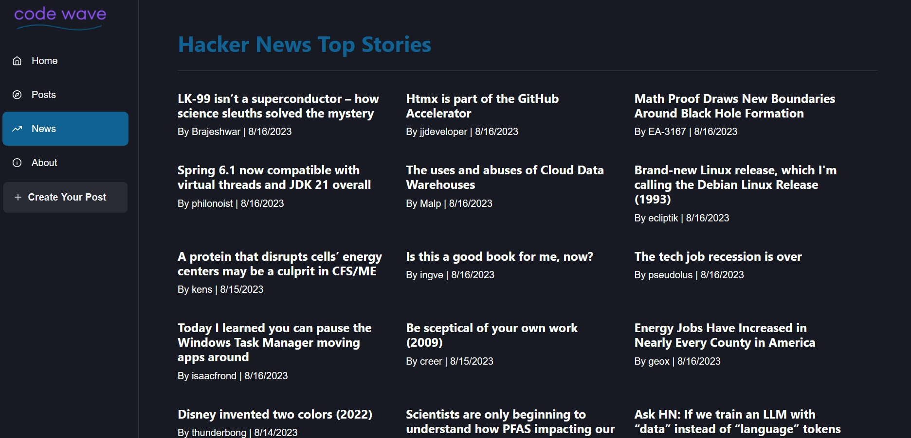
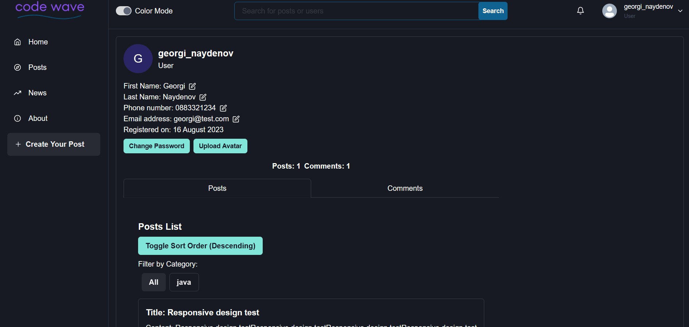

# CodeWave Forum Documentation


Welcome to the comprehensive documentation for the "CodeWave Forum" project. This guide presents an in-depth exploration of the project's purpose, functional specifications, technical intricacies, and the potential inclusion of optional features.



















## Project Overview

The CodeWave Forum is a dynamic web-based platform designed to cultivate engaging discussions, facilitate post creation, enable user comments, and encourage the upvoting/downvoting of content. Centered around the realm of JavaScript and Front-end programming, the platform serves as a dedicated hub for like-minded individuals.

## Functional Components

### Entity Management (Documents)

### User

> Each user profile necessitates a first and last name, alongside either an email or username.

> First and last names are confined within a character range of 4 to 32.

> Email entries must be both valid and unique within the system.

 ### Admin

> Admin profiles mirror user attributes, comprising of first and last names, and a unique email.

> Optional inclusion of a phone number is available.

> Name constraints of 4 to 32 characters apply.

> Unique email requirement remains.

### Post

> Every post is associated with a creator user, a title, content, comments, and an indication of likes received.

> Titles are constrained to a length ranging from 16 to 64 characters.

> Content occupies a length window of 32 to 8192 characters.

## Public Interface

> The homepage showcases pivotal platform statistics, including user counts and total posts, welcoming anonymous users.

> Registration and login functionality is accessible to anonymous visitors.

> Anonymous users are privy to lists of the top 10 most commented posts and the 10 most recently created posts.

## Private Features

> Authenticated users enjoy seamless login and logout capabilities.

> Browsing of posts created by fellow users, complete with sorting and filtering options.

> Comprehensive post viewing, encompassing title, content, comments, and likes. This interface further facilitates actions like commenting, liking, and direct editing.

> Profile enhancements, including the ability to upload a personalized profile photo.

> Post creation is streamlined with minimum title and content prerequisites.

> User-exclusive post and comment editing.

> A customizable viewing experience for a user's own posts and comments or those authored by others, with comprehensive filtering and sorting controls.

> Independent post removal capability.

> Engaging in comments and replies on a diverse range of forum posts.

## Administrative Control

> Administrative users wield the power to conduct user searches through usernames, emails, or display names.

>User management by admins extends to user blocking/unblocking, directly affecting post and comment permissions.

> Complete post deletion is within the scope of admin actions.

> Admins enjoy the capability to explore, filter, and sort all posts.

## Optional Enhancements

> Post Tags: An additional dimension to posts, allowing users to append tags for streamlined navigation and topic discovery.

> Tags provide supplementary context to posts, enhancing their discoverability.

>  The ability to search for posts using tags is supported.
    Tag management is extended to users, limited to their own posts. Admins, on the other hand, possess tag management rights across all posts.

## Technical Specifications
 ### Coding Guidelines

 > Coding adheres to Object-Oriented Programming (OOP) principles whenever applicable.

 > The spirit of KISS (Keep It Simple and Straightforward), SOLID, and DRY (Don't Repeat Yourself) principles guides the codebase.

 > Functional programming principles, including pure functions and judicious use of array methods, are seamlessly integrated.

 > A structured project architecture, featuring distinct layers, ensures clarity and scalability.

 > Exception handling is meticulously implemented, maintaining a graceful error propagation mechanism.

 >   Git serves as the chosen version control system, preserving a detailed commit history capturing project evolution and the contributions of all team members.

### Firebase Realtime Database


> The entirety of the project's data resides within the versatile NoSQL database offered by Google Firebase.

> The document structure within the database aligns harmoniously with the comprehensive functionalities described earlier.

### Optional Additions

> Integration with a Continuous Integration (CI) server, such as GitLab's CI, affords the benefits of automated unit testing upon every commit to the master branch.

> Git workflow emphasizes the use of branches for seamless collaboration.

> An ambitious goal of hosting the complete application on Firebase, incorporating both the Firebase Realtime Database and Firebase Hosting, sets the stage for a unified user experience.

## Hosting and Setup

To install and run the project locally, follow these steps:
Prerequisites

> Make sure you have Node.js and npm installed on your machine.

## Installation


Clone this repository to your local machine:

```bash
git clone https://gitlab.com/Georgi_Naydenov/codewave
```

Navigate to the project directory:

```bash
cd codewave
```
Install the required dependencies:
```bash
npm install
```
Start the development server:

```bash
npm run dev
```


## Database scheme
```
├── categories
│   ├── csharp
|   ├── java
│   ├── javascript
|   ├── others
│
├── comments
│   ├── commentId
│       ├── authorId: {string}
│       ├── content: {string}
│       ├── createdOn: {number/date}
│       ├── likedBy{string}:
│       │   ├── userHandle{string}: {bool}
│       ├── postId: {string}
│       ├── userName: {string}
|
├── posts
│   ├── postId
│       ├── authorId: {string}
│       ├── categoryId: {string}
│       ├── comments{string}:
│       │   ├── commentId{string}: true
│       ├── content: {string}
│       ├── createdOn: {number/date}
│       ├── likedBy{string}:
│       │   ├── userHandle{string}: true
│       ├── photoUrl: {string}
│       ├── tags{string}:
│       │   ├── tag{string}: {bool}
│       ├── title: {string}
│       ├── userName: {string}
|
├── users
│   ├── userName
│       ├── createdOn: {number/date}
│       ├── email: {string}
│       ├── firstName: {string}
│       ├── isBlocked: {bool}
│       ├── lastName: {string}
│       ├── likedComments{string}:
│       │   ├── commentId{string}: {bool}
│       ├── likedPosts{string}:
│       │   ├── postId{string}: {bool}
│       ├── role: {string}
│       ├── uid: {string}
│       ├── userName: {string}

```


## Hosting the Project

If you decide to host the entire application on Firebase, follow the Firebase documentation to set up Firebase Hosting and Firebase Realtime Database. Update the necessary Firebase configuration in your project to connect to Firebase services.
